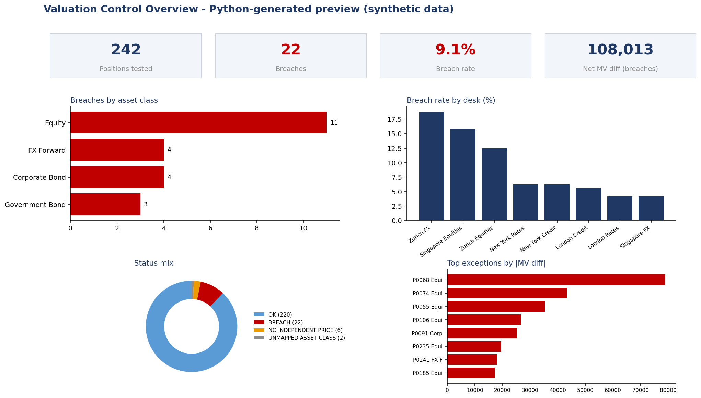
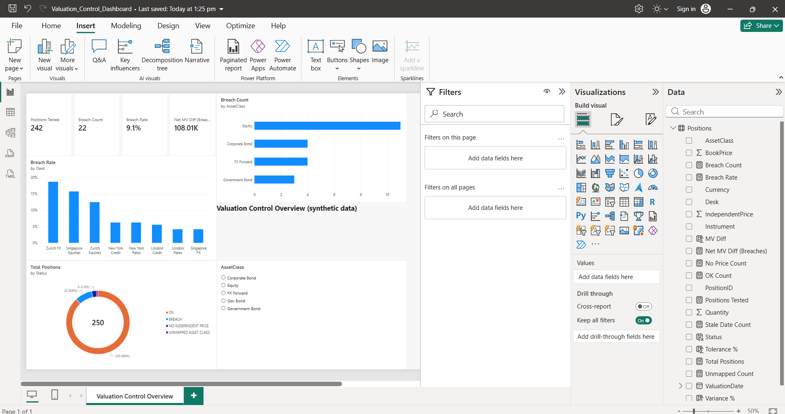

# Valuation Control Automation: Position Price Verification

Automating a valuation-control workflow: **clean > test > report > visualise**, using Excel (formulas + VBA), MS Access (SQL), Power BI (DAX) and a Python reference implementation.

> **Synthetic data only.** Every position, price and ID is invented, and the tolerance limits are illustrative assumptions. No real bank, client or market data is used.


*Preview generated with Python (matplotlib) from the project outputs. It shows the intended layout of the Power BI page; it is not a Power BI screenshot.*



## The problem
A valuation control team compares each desk's mark with an independent price and investigates positions outside tolerance. Done manually this means repeated cleaning, copy-paste and reporting. This project automates the chain and re-performs the same rules in several tools so the results can be reconciled.

## Control rules
| Rule | Definition |
|---|---|
| Variance % | (BookPrice - IndependentPrice) / IndependentPrice |
| Tolerance | Equity 1.00%, Corporate Bond 0.50%, Government Bond 0.25%, FX Forward 0.30% (assumed) |
| Status priority | `UNMAPPED ASSET CLASS` > `NO INDEPENDENT PRICE` > `BREACH` (abs variance > tolerance) > `OK` |
| Market value difference | Quantity x (Book - Independent), local currency, price per unit, no FX conversion |
| Duplicates | First occurrence of a PositionID kept |
| Breach rate | Breaches / (OK + Breaches) |

## Data
254 raw rows / 250 unique positions with deliberate quality problems: 4 duplicates, 6 missing independent prices, 5 stale valuation dates, 2 unmapped asset-class labels, 16 labels with wrong case or spacing, and 12 large price gaps.

## Results
Raw 254 | Duplicates removed 4 | Unique 250 | **OK 220 | Breaches 22 | No price 6 | Unmapped 2** | Stale dates 5 | **Breach rate 9.1%**

| Asset class | Tested | Breaches | Breach rate | Net MV diff |
|---|---|---|---|---|
| Equity | 78 | 11 | 14.1% | -253,879 |
| Corporate Bond | 68 | 4 | 5.9% | -36,124 |
| Government Bond | 56 | 3 | 5.4% | 6,558 |
| FX Forward | 40 | 4 | 10.0% | 49,762 |

Full output files are in [`outputs/`](outputs/): `Exceptions.csv`, `Summary_by_AssetClass.csv`, `Summary_by_Desk.csv`, `Data_Quality.csv`, `Checked_Positions.csv`.

## Status of each component
| Component | Status |
|---|---|
| Python reference implementation (`python/run_controls.py`) | Run; outputs in `outputs/`; asserts equality with `data/expected_results.json` |
| Excel workbook formulas (`excel/`) | Recalculated, 0 formula errors; all 250 row-level statuses match the Python result |
| Access SQL (`access/`) | Built in MS Access; `qry_ReconcileCounts` matches expected results (220 OK / 22 breaches / 6 no price / 2 unmapped) |
| VBA macro (`vba/`) | Run in Excel; `Run_Log` matches expected results (254 raw / 250 unique / 4 duplicates / 6 no price / 2 unmapped / 5 stale / 22 breaches / 9.1%) |
| Power BI (`powerbi/`) | Built in Power BI Desktop; measures match expected results (242 tested / 22 breaches / 9.1%) |

## Repository structure
```
data/        Raw_Positions.csv (messy input), Clean_Positions.csv, Thresholds.csv, expected_results.json
excel/       Valuation_Control_Workbook.xlsx  (Thresholds, Raw_Data, Checks, Summary sheets - formula driven)
vba/         ValuationAutomation.bas          (RunAll: clean, test, Clean_Data, Exceptions, Run_Log, CSV export)
access/      Access_Setup_and_Queries.sql     (tables, price check, exceptions, summaries, data quality)
powerbi/     DAX_Measures.dax, Dashboard_Build_Guide.md
python/      generate_data.py, build_workbook.py, run_controls.py
outputs/     Generated reports and dashboard preview
```

## How to run
**Python** (from the repository root)
```bash
pip install -r requirements.txt
python python/generate_data.py     # regenerates the synthetic data (seeded, reproducible)
python python/run_controls.py      # writes outputs/ and checks the expected results
```
**Excel + VBA (Windows):** open `excel/Valuation_Control_Workbook.xlsx` > Save As `.xlsm` > `Alt+F11` > File > Import `vba/ValuationAutomation.bas` > `Alt+F8` > `RunAll`. Compare the pop-up with the results above.
**Access:** import `Clean_Positions.csv` and `Thresholds.csv`, then create the queries in `access/Access_Setup_and_Queries.sql`. `qry_ReconcileCounts` should show 220 / 22 / 6 / 2.
**Power BI:** follow `powerbi/Dashboard_Build_Guide.md`.

## Assumptions and limitations
Synthetic data; illustrative tolerances; differences in local currency (no FX conversion); prices per unit; one valuation date; unmapped labels are flagged rather than guessed; missing prices are never treated as zero. Possible extensions: base-currency conversion, notional-based tolerances, ageing of open breaches, a comment/approval workflow, scheduled runs.

## Author
Arone Benedict L - [LinkedIn](https://www.linkedin.com/in/arone-benedict-l-8ab62325b) | [GitHub](https://github.com/AroneBenedict)

Licensed under the MIT License.
